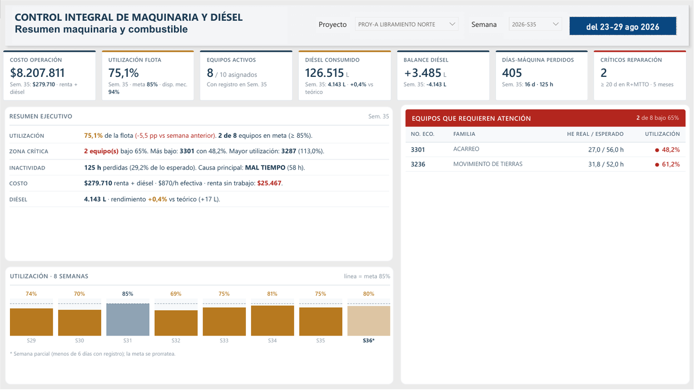
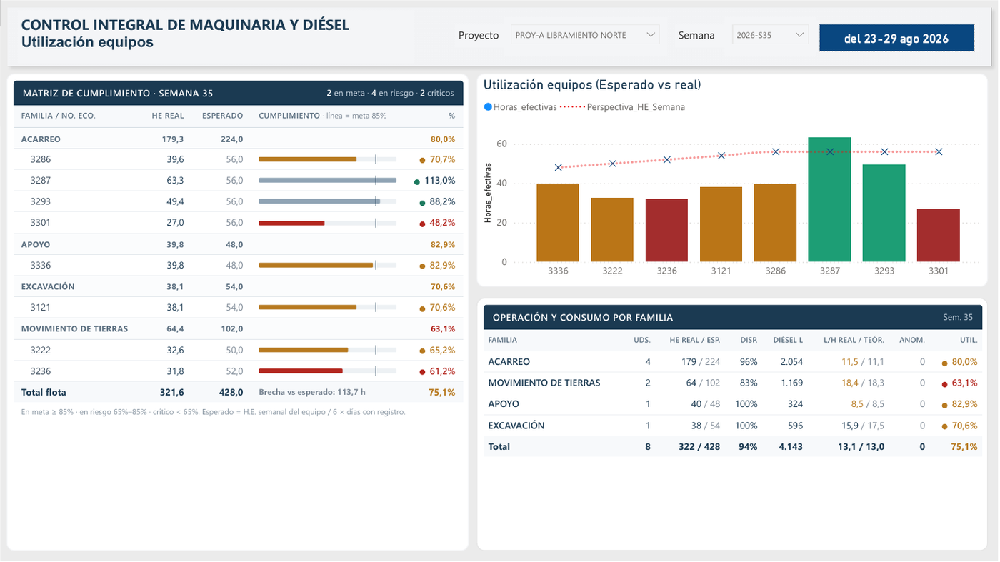
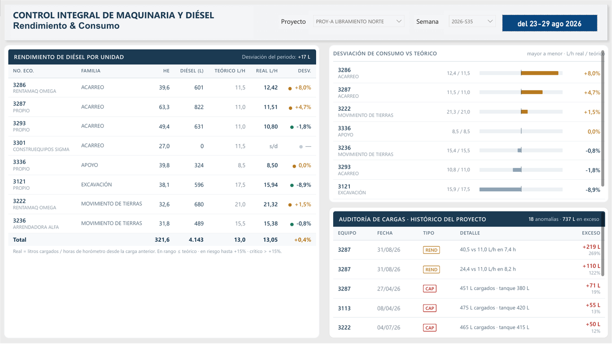
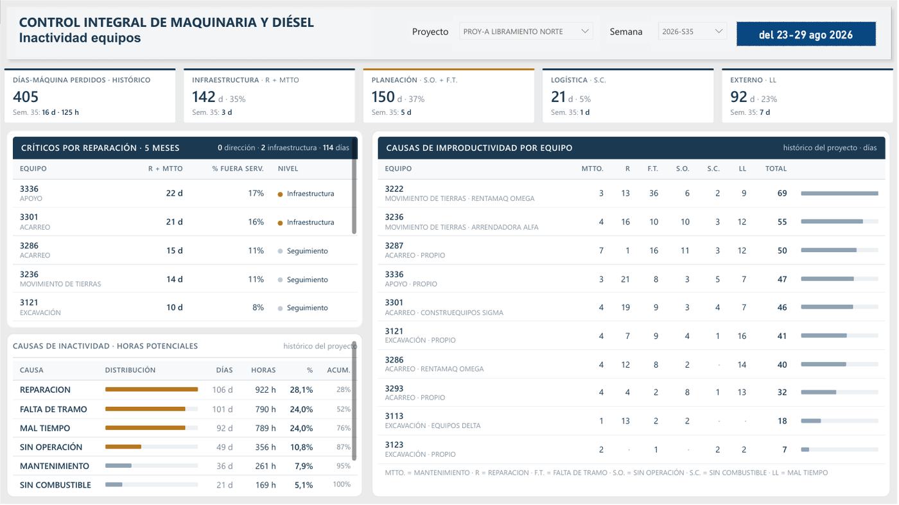
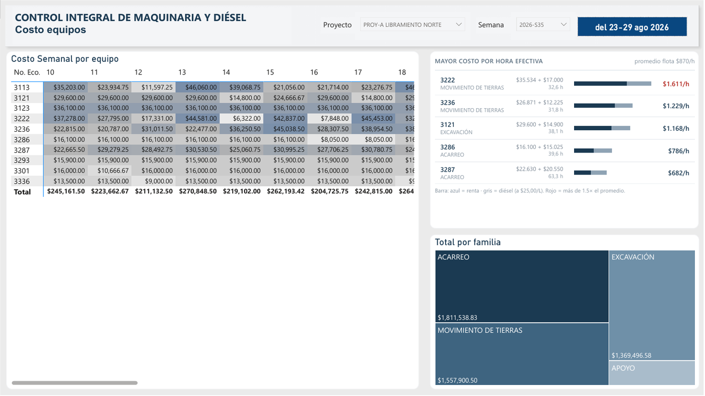
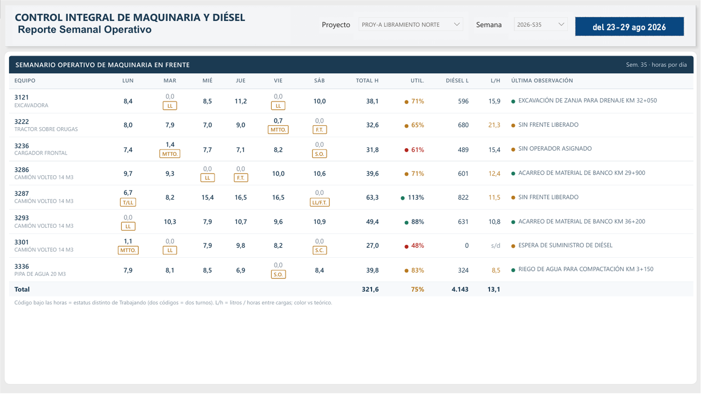
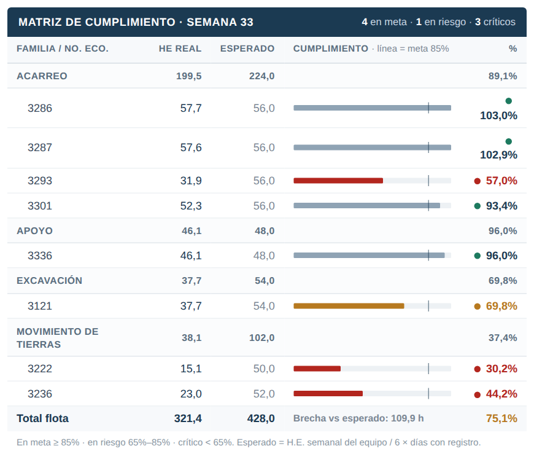
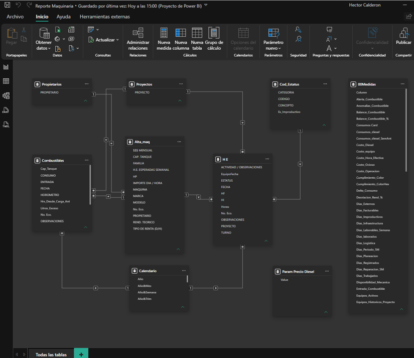

# Control Integral de Maquinaria y Diésel · Power BI

**Tablero de control para constructoras que rentan u operan maquinaria pesada.** Responde en una sola vista lo que normalmente toma días de conciliar entre bitácoras, facturas de renta y vales de diésel: qué equipo está trabajando, cuánto está costando, por qué se detuvo y si está consumiendo el diésel que debería.



> Datos ficticios con fines de demostración. El modelo completo (`.pbip`) no se publica; este repositorio muestra el resultado y el enfoque.

---

## El problema

En obra, la maquinaria suele ser el segundo costo más grande después de la mano de obra, y el que menos visibilidad tiene:

- La renta se paga aunque el equipo esté parado por lluvia, por falta de frente de trabajo o esperando refacciones.
- El diésel se controla con vales en papel; nadie compara lo cargado contra lo que el equipo debería consumir.
- Los reportes semanales se arman a mano en Excel, llegan tarde y cada residente los calcula distinto.

## La solución

Un modelo en Power BI que toma la bitácora diaria de horómetros y las cargas de combustible, y entrega:

| Pregunta de negocio                     | Cómo la responde el tablero                                                                       |
| --------------------------------------- | -------------------------------------------------------------------------------------------------- |
| ¿Qué equipos están subutilizados?    | Utilización real contra la meta de cada equipo, con semáforo y tendencia de 8 semanas            |
| ¿Por qué no trabajó?                 | Causa de cada día perdido (reparación, falta de frente, clima, combustible…) y su peso en horas |
| ¿Quién pasa más tiempo en el taller? | Ranking de equipos críticos por reparación con nivel de escalamiento                             |
| ¿Hay fuga o desperdicio de diésel?    | Rendimiento real contra el teórico de fábrica y auditoría automática de cargas sospechosas     |
| ¿Cuánto cuesta cada hora trabajada?   | Costo de operación por equipo (renta + diésel) y renta pagada sin trabajo                        |
| ¿Cuánto diésel queda en obra?        | Balance de entradas contra consumo                                                                 |

<table>
<tr>
<td></td>
<td></td>
</tr>
<tr>
<td></td>
<td></td>
</tr>
</table>



El reporte completo exportado está en [`pdf/Reporte Maquinaria.pdf`](<pdf/Reporte%20Maquinaria.pdf>).

---

## Lo que encontró el tablero (datos de demostración, un proyecto, semana 35)

- **La utilización real fue 75 %, no el 80 % que marcaba el cálculo original.** Cada equipo se mide contra su propia meta de horas, no contra un valor fijo; eso cambió el diagnóstico de varias unidades.
- **Solo 2 de 8 equipos en meta, 4 en riesgo y 2 en zona crítica**; el más bajo trabajó al 48 % de lo esperado.
- **En la historia del proyecto se perdieron más días por planeación (37 %) que por fallas mecánicas (35 %)**: equipos parados por falta de frente de trabajo o sin operador. Es un problema de gestión, no de taller.
- **16 cargas de diésel registradas por encima de la capacidad del tanque y 2 con sobreconsumo contra el rendimiento de fábrica** (una de ellas a 40 L/h en un camión de 11 L/h teóricos), detectadas automáticamente para revisión.
- **$25,467 de renta pagada en la semana por días sin una sola hora trabajada**, cuantificada por equipo.

## Qué hace diferente a este modelo

- **Métricas que se pueden sumar sin distorsionarse.** El mismo indicador es correcto por equipo, familia, proyecto, semana, mes o cualquier rango, y se ajusta solo en semanas incompletas.
- **Rendimiento de diésel medido carga a carga con el horómetro**, no dividiendo litros de la semana entre horas de la semana. El segundo método da cifras que brincan de 2 a 40 L/h sin que nada haya cambiado en campo.
- **Reglas de negocio parametrizadas.** Metas, tolerancias, precio del diésel y umbrales de escalamiento se ajustan en un solo lugar, sin tocar los cálculos.
- **Catálogo de causas escalable.** Un código de estatus nuevo aparece en todos los análisis sin modificar el reporte.
- **Diseño ejecutivo consistente.** Todos los paneles comparten un mismo sistema visual: un solo criterio de color (en meta / en riesgo / crítico), sin adornos, con la metodología anotada al pie de cada tabla.

## Muestra técnica

Tres fragmentos del modelo, recortados. El modelo completo tiene más de 80 medidas organizadas en parámetros, utilización, combustible, costos, inactividad y paneles HTML.

### 1. Meta de horas que se ajusta sola

**Problema que resuelve:** con una meta fija de 50 h por semana, un equipo con meta de 56 h aparecía al 115 %, y una semana con un solo día de datos aparecía al 14 %. Ahora cada equipo se mide contra su propia meta y solo por los días que realmente estuvo en obra, y el mismo cálculo sirve por equipo, familia, proyecto, semana o mes.

```dax
HE_Esperadas =
SUMX (
    SUMMARIZE ( 'H E', Alta_maq[No. Eco.], Alta_maq[H.E. ESPERADAS SEMANAL] ),
    DIVIDE ( Alta_maq[H.E. ESPERADAS SEMANAL], [Dias_Laborables_Semana] )
        * [Dias_Registrados]
)

Utilización_% = DIVIDE ( [Horas_efectivas], [HE_Esperadas] )
```

### 2. Tendencia de 8 semanas anclada a la semana seleccionada

**Problema que resuelve:** la gráfica de tendencia mostraba siempre las últimas 8 semanas con datos, sin importar qué semana eligiera el usuario, e incluía semanas a medias. Ahora termina en la semana seleccionada y marca las incompletas.

```dax
VAR fechaAncla = CALCULATE ( MAX ( 'H E'[FECHA] ) )
VAR claveAncla = LOOKUPVALUE ( Calendario[Año&Semana], Calendario[IdFecha], fechaAncla )
VAR semanas =
    CALCULATETABLE (
        SUMMARIZE ( 'H E', Calendario[Año&Semana], Calendario[NumeroSemana] ),
        REMOVEFILTERS ( Calendario ),
        Calendario[Año&Semana] <= claveAncla
    )
VAR conUtil =
    ADDCOLUMNS (
        semanas,
        "@util",
            VAR k = Calendario[Año&Semana]
            RETURN CALCULATE ( [Utilización_%], REMOVEFILTERS ( Calendario ), Calendario[Año&Semana] = k ),
        "@dias",
            VAR k = Calendario[Año&Semana]
            RETURN CALCULATE ( DISTINCTCOUNT ( 'H E'[FECHA] ), REMOVEFILTERS ( Calendario ), Calendario[Año&Semana] = k )
    )
VAR ultimas8 = TOPN ( 8, FILTER ( conUtil, NOT ISBLANK ( [@util] ) ), Calendario[Año&Semana], DESC )
-- ... render de barras en HTML
```

### 3. Panel HTML generado desde DAX

**Problema que resuelve:** las tablas nativas no permiten barras con marca de meta, agrupación por familia y un solo criterio de color en todo el reporte. Cada fila de la matriz de cumplimiento se arma desde DAX; el estado (en meta / en riesgo / crítico) sale de una medida compartida por todos los paneles.

```dax
HTML_Utiliz_Row =
VAR umbral = [HE_Esperadas]
VAR pct    = [Utilización_%]
VAR est    = [Estado_Utilizacion]          -- ok / warn / bad / na
VAR ancho  = FORMAT ( MIN ( MAX ( pct, 0 ), 1 ) * 100, "0" )
RETURN
IF ( ISBLANK ( umbral ) || umbral = 0, "",
    "<tr><td class='ind'>" & SELECTEDVALUE ( Alta_maq[No. Eco.] ) & "</td>"
    & "<td class='num'>" & FORMAT ( [Horas_efectivas] + 0, "0.0" ) & "</td>"
    & "<td class='num muted'>" & FORMAT ( umbral, "0.0" ) & "</td>"
    & "<td class='bar'><div class='bt'>"
    &   "<div class='bf " & IF ( est = "ok", "", est ) & "' style='width:" & ancho & "%'></div>"
    &   "<div class='mk' style='left:" & FORMAT ( [Meta_Utilizacion] * 100, "0" ) & "%'></div>"
    & "</div></td>"
    & "<td class='num strong'><span class='dot " & est & "'></span>" & FORMAT ( pct, "0.0%" ) & "</td></tr>"
)
```

Resultado:



## Modelo de datos

Esquema estrella con dos tablas de hechos (bitácora diaria de equipos y movimientos de diésel) y catálogos de equipos, estatus, proyectos, propietarios y calendario.



## Páginas del reporte

| Página                         | Para quién                | Contenido                                                       |
| ------------------------------- | -------------------------- | --------------------------------------------------------------- |
| **Centro de Mando**       | Dirección                 | Indicadores clave, resumen ejecutivo, alertas y tendencia       |
| **Utilización**          | Gerencia de maquinaria     | Cumplimiento por equipo y por familia                           |
| **Rendimiento & Consumo** | Control de combustible     | Desviación vs teórico y auditoría de cargas                  |
| **Inactividad**           | Residencia de obra         | Días perdidos por causa, equipos críticos por reparación     |
| **Combustible**           | Almacén / administración | Entradas, consumo, balance y anomalías                         |
| **Costo**                 | Administración            | Costo semanal por equipo y costo por hora efectiva              |
| **Semanarios**            | Frente de obra             | Vista diaria de horas, estatus, litros y observaciones de campo |

## Herramientas

Power BI Desktop · Power Query (M) · DAX avanzado · modelado dimensional · HTML/CSS generado desde DAX.

## Siguientes pasos

- Integrar costos de mantenimiento para identificar equipos cuyo mantenimiento supera lo que producen.
- Integrar producción (m³, viajes, avance) para medir margen por equipo.
- Conexión a base de datos para actualización automática.

---

## Contacto

**Héctor Calderón** · Análisis de datos para control de obra y maquinaria

¿Te interesa implementar algo similar con los datos de tu empresa? Escríbeme por [LinkedIn](https://www.linkedin.com/in/hmcalderon-aguilar) o abre un *issue* en este repositorio.
